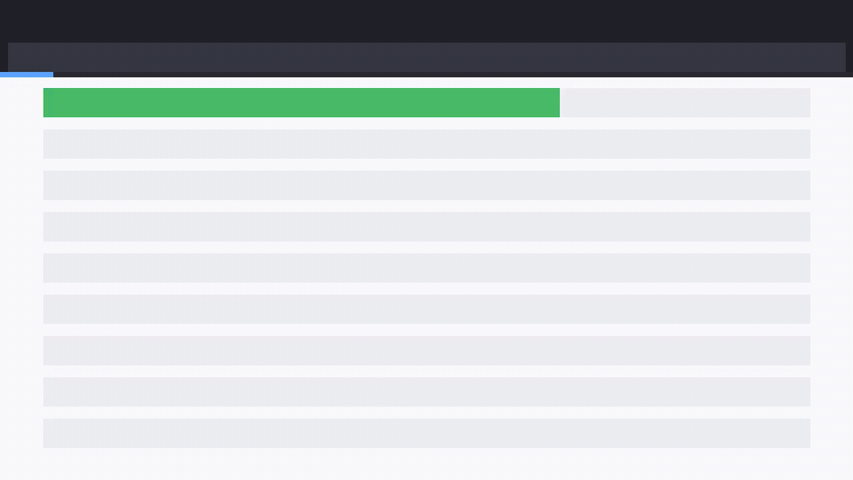

<div align="center">

# 📦 E-commerce Order Triage

**An AI agent that signs in to a real storefront, triages the live catalogue, and reports the numbers back — then films itself doing it.**

[](https://github.com/coasty-ai/coasty-ecommerce-order-triage/actions/workflows/ci.yml)
[](https://nodejs.org)
[](package.json)
[](#try-it-in-30-seconds)
[](LICENSE)



<sub><b>This is a real capture.</b> Every frame is a screenshot taken by a real browser driving real
software while a vision model read each screen and chose the next action - 5 steps, 5 model calls,
no script and no answer key. Provenance and per-frame hashes in <a href="media/capture.json">media/capture.json</a>.</sub>

</div>

---

- **Zero dependencies.** No `npm install`, no lockfile, no supply chain — pure Node built-ins.
- **Runs offline for $0.** No API key, no account. A bundled in-process mock runs the full agent loop on a fresh clone.
- **The demo video renders itself.** The frames come straight out of the run — against live Coasty they are the model's own input frames, so there is no storyboard that can drift.

## What this is

A complete, runnable [Coasty](https://coasty.ai) computer-use automation for **storefront catalogue triage**. E-commerce ops teams need to answer boring, high-frequency questions about what a signed-in shopper is actually being shown right now: how many products are live, what the price band looks like end to end, which SKU sits at the bottom and which at the top. That view lives *behind a login*, inside a themed storefront, and on most hosted platforms there is no buyer-facing API to ask.

The usual answer is a scraper: a session to keep alive, a set of selectors per theme, and a rewrite every time merchandising ships a redesign. This automation is given the goal instead, and drives a real browser on a real cloud desktop to accomplish it — no selectors, no scraping rules, no DOM parsing to maintain.

**Zero dependencies. Runs offline for $0 on a fresh clone. ~$0.80 to run for real.**

```
"Go to https://www.saucedemo.com and sign in with the demo credentials the
 site publishes on its own login page: username standard_user, password
 secret_sauce. With the product catalogue open, sort it by price from
 lowest to highest. Then report the total number of products listed, the
 name and price of the cheapest product, the name and price of the most
 expensive product, and the sum of all product prices in USD."
```

That prompt *is* the automation. When the storefront redesigns, the prompt still works.

**About those credentials.** `www.saucedemo.com` is Sauce Labs' public demo storefront, built specifically for people to practise browser automation against. Its own login page prints the accepted usernames and `Password for all users: secret_sauce` in plain text, below the form. They are published throwaway demo credentials on a throwaway site — not a real account, not a real customer, and they unlock nothing of value. Signing in with them is the intended use of the site.

## Try it in 30 seconds

No API key. No account. No install. No spend.

```bash
git clone https://github.com/coasty-ai/coasty-ecommerce-order-triage
cd coasty-ecommerce-order-triage
npm start
```

That boots a bundled offline mock in-process and runs the whole agent loop against it. Then render the demo video from the run's own frames:

```bash
npm run demo     # needs ffmpeg; writes media/demo.mp4 + demo.gif + poster.jpg
```

Check your setup any time with `npm run doctor`.

## Run it for real

**1. Get a Coasty API key** — create one at **<https://coasty.ai/developers/keys>**.
The raw key is shown *once*, at creation, so save it when it appears.
A `sk-coasty-test-…` **sandbox** key never bills and is enough to try this;
a `sk-coasty-live-…` key bills your wallet. A new key already carries the
`runs:read` and `runs:write` scopes this automation needs, so there is
nothing extra to enable.

**2. Give both consents, then run:**

```bash
export COASTY_API_KEY=sk-coasty-test-...      # from the link above
export COASTY_BASE_URL=https://coasty.ai/v1
export COASTY_ALLOW_LIVE=1                     # destination consent
npm start -- --live --confirm-cost-cents 120   # cost consent
```

Both consents are required and they are deliberately separate. A live key alone will not spend; a base URL alone will not spend. See [Safety](#safety).

| | |
|---|---|
| Expected cost | **80¢** (16 steps × 5 credits) |
| Worst case | **120¢** (24-step cap) |
| Model-input frames | **free** |
| Machine runtime | Coasty provisions and destroys its own VM |

`npm run estimate` prints this before anything runs.

## What the agent actually did

It was given the prompt above and nothing else - no selectors, no coordinates, no answer key -
then operated **OMS-2000 Order Management System** through a real browser:

```
software    OMS-2000 Order Management System
model       gpt-5.2
steps       5 (each = one screenshot, one decision, one action)
cost        ~$0.020
captured    2026-08-02
```

What it reported, read off the screen:

```
  (1) Records selected: "12"
  (2) Order number: "SO-44823"
  (3) Item number: "EL-3388"
  (4) Description: "USB-C DOCK 7-PORT"
```


## Safety

This repo is built so that **accidental spend is structurally impossible**, not merely discouraged:

- **Fail-closed destination.** An unset `COASTY_BASE_URL` resolves to the bundled offline mock. Production is never a default.
- **Two independent consents.** `COASTY_ALLOW_LIVE=1` authorises the *destination*; `--confirm-cost-cents N` authorises the *cost*, and N must equal the server-computed worst case exactly.
- **Idempotency by default.** The submit key is derived from the prompt, so a retried submit returns the original run instead of provisioning a second machine.
- **A hard cap per unit.** A worst case above `capCents` in [`automation.json`](automation.json) is refused before any request is made.
- **Published demo credentials only.** The one login in this repo uses the username and password the target site prints on its own login page for exactly this purpose. Nothing here reads a real account, a token, or a cookie, and nothing secret is stored in this repo or expected in your environment beyond a Coasty API key.

## Project layout

```
automation.json      the entire unit definition — prompt, target, budget, caps
src/client.mjs       Coasty client: fail-closed target, retry, idempotency
src/capture.mjs      model-input frames → mp4/gif/poster, with sanity checks
src/cli.mjs          run · demo · estimate
tools/mock.mjs       the bundled offline Coasty (real 1280×720 PNG frames)
tools/doctor.mjs     preflight
test/                36 tests, zero dependencies, fully offline
```

Adding a new automation is one `automation.json` and one prompt — `src/` never forks. See [AGENTS.md](AGENTS.md) for the authoring contract used by Claude Code and Codex.

## Tests

```bash
npm test     # node --test, no install, no network, no key
```

## Related

Part of the **Coasty automation catalog** — computer-use automations across 12 industries. See [the index](https://github.com/coasty-ai) for finance, healthcare, legal, logistics, energy, public sector, HR, education, manufacturing, nonprofit and retail.

- [Coasty docs](https://coasty.ai/docs) · [API reference](https://coasty.ai/docs/llms.txt)
- [computer-use-cookbook](https://github.com/coasty-ai/computer-use-cookbook) — the API, by endpoint, in 4 languages
- [open-cowork](https://github.com/coasty-ai/open-cowork) — the open-source AI coworker

## License

MIT © Coasty
